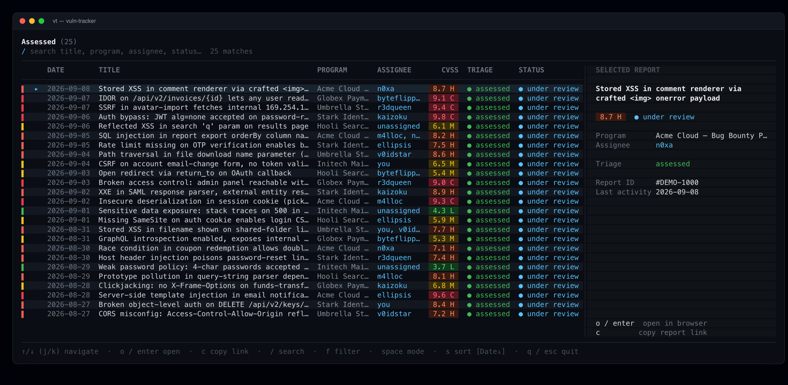
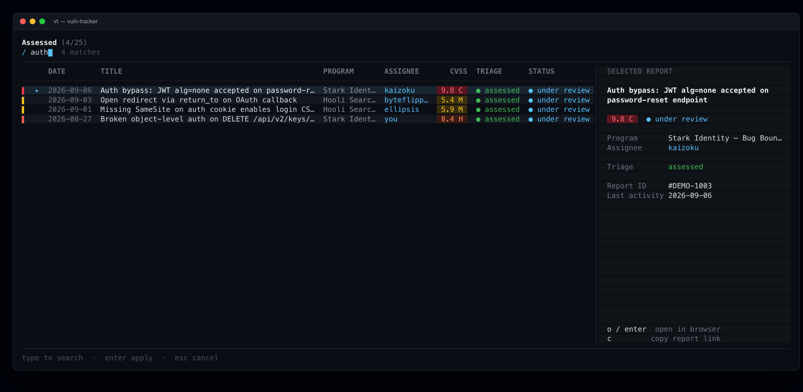
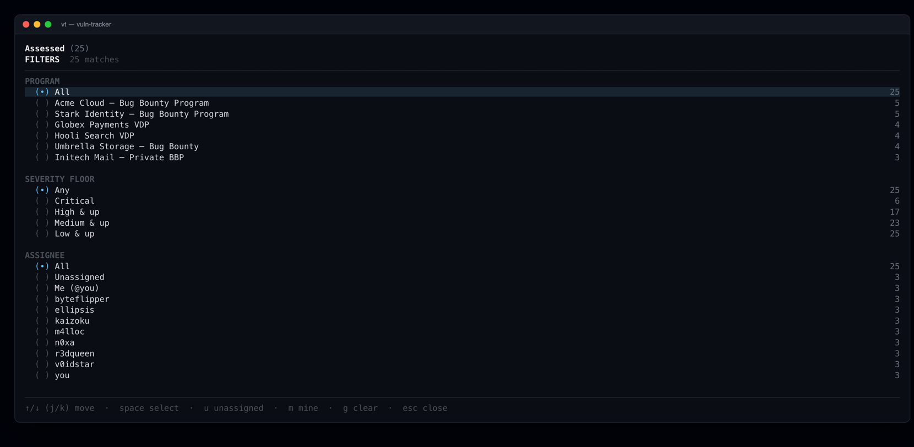
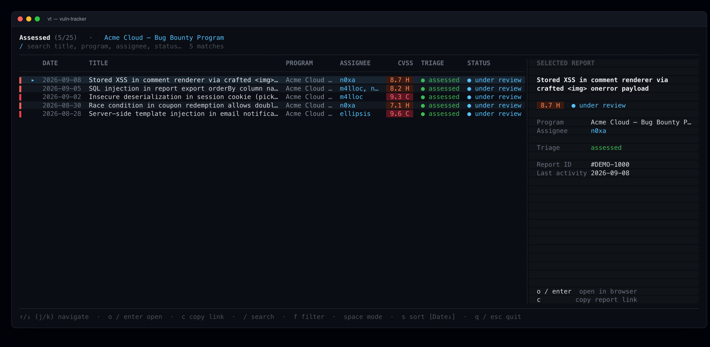

# vuln-tracker

Browse YesWeHack reports that triagers have assessed, from the terminal.



<sub>Screenshots use synthetic demo data — programs, report titles, and usernames are made up.</sub>

## Setup

1. Install dependencies:

   ```bash
   npm install
   ```

2. Create a `.env` file in the project root with your YesWeHack API key:

   ```bash
   YESWEHACK_API_KEY=your-api-key-here
   ```

3. Link the `vt` command so it runs from any directory:

   ```bash
   npm link
   ```

   This symlinks `vt` onto your `PATH` (pointing at `src/index.js`). The `.env`
   is resolved relative to the install location, so `vt` works from anywhere.

## Usage

```bash
vt              # browse reports (prompts for scope: all reports / only mine)
vt -r           # ignore the on-disk cache and do a full refetch
vt --no-cache   # don't read or write the cache
```

Without `npm link`, run it directly with `node src/index.js`.

Choosing "only my reports" prompts once for your YesWeHack username and stores
it in `~/.config/vuln-tracker/config.json`.

## In the list

Navigate with `↑`/`↓` (or `j`/`k`), `o`/`enter` opens the report in the browser,
`c` copies its link. `space` switches view mode (Assessed / Under Review / All /
Accepted) and `s` cycles the sort key.

**Search** — press `/` and type to match against title, program, assignee, and
status as you go.



**Filters** — press `f` for the overlay: filter by program, a minimum CVSS
severity floor, or assignee (with `unassigned` and `me` shortcuts). The active
filter shows in the header and `g` clears it.





## Optional environment variables

| Variable | Default | Purpose |
| --- | --- | --- |
| `YWH_CONCURRENCY` | `8` | Parallel API requests |
| `YWH_CACHE_TTL_MS` | `0` | Soft cache TTL |
| `YWH_CACHE_HARD_TTL_MS` | `86400000` | Hard cache TTL (24h) |
| `YWH_INCREMENTAL_PAGES` | `2` | Pages refetched on an incremental update |
| `YWH_SERVER_FILTER` | — | Set to `0` to disable server-side filtering |
